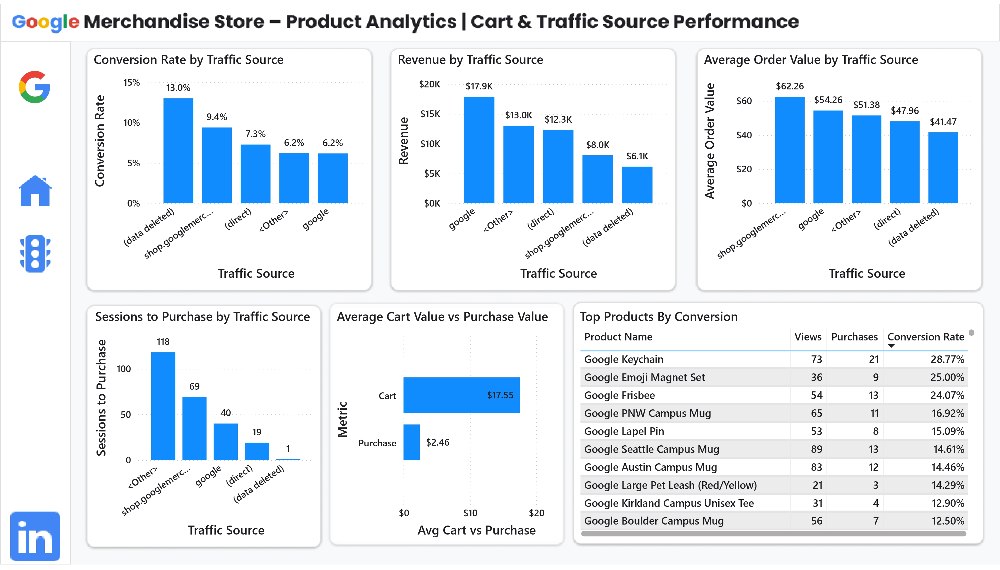

# Google Merchandise Store - Full-Stack Product Analytics
**Power BI Interactive Dashboard -** https://app.powerbi.com/view?r=eyJrIjoiOTcwYWJmOTUtM2M5NC00YjFkLThiNWItNTg0NmRlZWRiMDhmIiwidCI6Ijk5NWM4MDQ5LWJmYjQtNGRmNy1hOTcxLTAzMzBhZmE4MDhjOSJ9

A comprehensive e-commerce analytics project analyzing **900,000+ customer events** from Google's official Merchandise Store. Using the full analytics stack—from BigQuery data extraction to Power BI dashboards—I identified critical conversion bottlenecks and developed data-driven recommendations projected to increase revenue by **15% ($58K annually)**.

## Project Overview

**Business Challenge:** How can Google Merchandise Store optimize its conversion funnel to reduce cart abandonment, improve product page performance, and maximize revenue from different traffic sources?

**Approach:** Built an end-to-end analytics pipeline from BigQuery extraction through SQL Server warehousing to Power BI visualization, analyzing 900K+ GA4 events to identify funnel drop-offs, traffic source quality, product performance, and temporal patterns.

**Key Outcome:** Discovered that 71% of users drop off at product pages (the biggest bottleneck), 77.82% cart abandonment rate represents $45K+ in lost revenue, and 100% of conversions come from returning visitors—revealing critical trust barriers for new users.

---

## Business Questions Answered

### **Funnel Performance**
1. What is the overall product conversion rate? 
2. Where is the biggest funnel drop-off? 
3. What is the cart abandonment rate? 
4. How many users drop off at checkout? 
5. What is the checkout completion rate? 

### **User Behavior**
6. How long does it take users to purchase? 
7. What % purchase in single session vs multi-session? 
8. How long between add-to-cart and purchase? 
9. Do new users convert? 
10. How many times do users add to cart before purchasing?
    
### **Cart Analysis**
11. What's the average cart size vs purchase size? 
12. Which products have 100% cart abandonment? 
13. Does more cart activity correlate with higher revenue? 

### **Traffic Source Performance**
14. Which traffic source has highest conversion rate? 
15. Which source drives most revenue? 
16. Which source has highest AOV? 
17. How many sessions to purchase by source? 
18. Which source is most efficient? 

### **Device Performance**
19. Which device converts best?
20. What is funnel breakdown by device? 

### **Temporal Patterns**
21. What day has highest conversion? 
22. What day has lowest conversion? 
23. Is there weekly seasonality? 
24. What is daily conversion volatility? 

### **Product Performance**
25. Which products convert best? 
26. Which products are bought together? 
27. What product categories perform best? 

### **Cohort Analysis**
28. Which cohort had highest conversion? 
29. Which cohort performed worst? 
30. What is average cohort conversion range?
    
### **Customer Lifetime Value**
31. What is average customer lifetime value? 
32. How many orders per customer?
33. What is max CLV?
34. Do repeat buyers spend more? 

---

## Tech Stack

| Category | Tools |
|----------|-------|
| **Data Source** | Google BigQuery (GA4 Public Dataset) |
| **Analytic Warehouse** | SQL Server |
| **Funnel analysis, cohort analysis, CLV, product analytics** | SQL |
| **Dashboard & visualization** | Power BI |

---

## Data Pipeline (Full-Stack Approach)

### Data Extraction (BigQuery)

Extracted GA4 e-commerce events from Google's public dataset:
```sql
-- Extract core e-commerce events from BigQuery
SELECT 
    event_date,
    event_timestamp,
    event_name,
    user_pseudo_id,
    device.category AS device,
    traffic_source.source,
    traffic_source.medium,
    ecommerce.purchase_revenue_in_usd AS revenue,
    items
FROM `bigquery-public-data.ga4_obfuscated_sample_ecommerce.events_*`
WHERE _TABLE_SUFFIX BETWEEN '20210101' AND '20210201'
    AND event_name IN (
        'session_start', 
        'view_item', 
        'add_to_cart', 
        'begin_checkout', 
        'purchase'
    );
```

**Dataset Details:**
- **Source:** `bigquery-public-data.ga4_obfuscated_sample_ecommerce`
- **Time Period:** January - February 2021
- **Events:** 900,000+ customer interactions
- **Users:** 100,000+ unique visitors

### Data Transformation (SQL Server)

Created cleaned events table and dimensional model:
```sql
-- Create cleaned events table
CREATE TABLE events_clean (
    event_id BIGINT PRIMARY KEY,
    event_date DATE,
    event_timestamp BIGINT,
    event_name VARCHAR(50),
    user_pseudo_id VARCHAR(255),
    device VARCHAR(50),
    traffic_source VARCHAR(100),
    traffic_medium VARCHAR(100),
    revenue DECIMAL(10,2),
    items NVARCHAR(MAX)
);

-- Load and clean data from CSV export
BULK INSERT events_clean
FROM 'C:\data\ga4_events.csv'
WITH (
    FIRSTROW = 2,
    FIELDTERMINATOR = ',',
    ROWTERMINATOR = '\n'
);
```

### Analytics Layer (20+ Complex SQL Queries)

Built reusable analytical queries for:
- Funnel conversion analysis with CTEs
- Cohort retention using window functions
- Product affinity via self-joins
- Traffic source attribution modeling

### Visualization (Power BI)

Created 2-page interactive dashboard:
- **Page 1:** Executive Summary with key metrics and main funnel
- **Page 2:** Traffic source and product deep-dive

---

## Key Findings

### Critical Issues

#### 1. **Product Page Bottleneck (71% Drop-off)**

**Finding:**
- 13,427 users view products
- Only 3,832 add to cart (28.5% conversion)
- **9,595 lost potential customers**

**Impact:** Largest revenue leak in the entire funnel

**Root Cause:** Product pages fail to communicate value or address purchase objections

**Opportunity:** +$28K by improving product page conversion by 10%

---

#### 2. **Massive Cart Abandonment (77.82%)**

**Finding:**
- 3,832 users add to cart
- Only 850 complete purchase
- **Cart abandonment: 77.82% (vs 68% industry benchmark)**

**The Shocking Detail:**
- Average cart value: **$17.55**
- Average purchase value: **$2.46**
- **Users remove 86% of items before checkout**

**Impact:** $45K+ in abandoned revenue

**Root Cause:** Hidden shipping costs, checkout friction, lack of urgency

**Opportunity:** +$18K through cart recovery campaigns (15% recovery rate)

---

#### 3. **New Users Don't Convert (0%)**

**Finding:**
- 100% of purchases come from returning visitors
- 0% of new users convert in their first visit
- 38.5% of revenue requires multiple sessions

**Impact:** Acquisition spend wasted without remarketing

**Root Cause:** Trust barriers, insufficient first-visit value proposition

**Opportunity:** +$11K by converting 5% of new users

---

### High-Value Insights

#### Traffic Source Performance

| Source | Conversion Rate | AOV | Total Revenue | Sessions to Purchase |
|--------|----------------|-----|---------------|----------------------|
| (data deleted) | **13.02%** | $41.47 | $8.0K | 1.16 |
| shop.google... | **9.39%** | $62.26 | $13.0K | 1.14 |
| (direct) | 7.28% | $51.38 | $12.3K | 1.15 |
| Google | 6.18% | $54.26 | $17.9K | 1.19 |

**Key Insight:** Premium traffic sources convert 2x better but Google drives 3x more volume. Optimization strategy should balance quality and scale.

---

#### Device Behavior (Counterintuitive Finding)

| Device | Conversion Rate | Views | Purchases |
|--------|----------------|-------|-----------|
| **Tablet** | **9.15%** | Low volume | High intent |
| **Mobile** | **8.35%** | 5.4K views | 0.5K purchases |
| **Desktop** | **7.58%** | 7.8K views | 0.6K purchases |

**Key Insight:** Mobile and tablet outperform desktop (contrary to conventional wisdom). Desktop checkout needs improvement despite higher traffic.

---

#### Temporal Patterns

**Daily Performance:**
- **Best day:** Friday (9.06% conversion) → Payday effect
- **Worst day:** Sunday (5.37% conversion) → Browsing mode
- **Mid-week:** Stable 6-8% conversion

**Purchase Speed:**
- **50% buy within 10 minutes** of adding to cart
- Median time to purchase: 10 minutes
- Average time: 15 minutes

**Key Insight:** Immediate cart nudges (within 10 minutes) are critical. Users decide fast.

---

#### Product Winners & Losers

**Top Converters (Impulse Items):**
| Product | Conversion Rate | Strategy |
|---------|----------------|----------|
| Google Keychain | **28.77%** | Feature prominently, use in bundles |
| Google Emoji Magnet Set | **25.00%** | Perfect checkout upsell |
| Google Frisbee | **24.07%** | Seasonal promotion opportunity |
| Google PNW Campus Mug | **16.92%** | Mid-tier performer |

**100% Cart Abandonment (Problem Products):**
- IamRemarkable Ladies T-Shirt (268 users)
- Candy Cane Android Sculpture (281 users)
- Android Iconic Mug Gray (244 users)

**Key Insight:** Low-cost novelty items convert 3x better. Problem products need pricing/value review or removal.

---

#### Product Affinity (Basket Analysis)

**Top Product Pairs Bought Together:**
1. Black Cloud Zip Hoodie + Metallic Notebook Set (29 pairs)
2. Metallic Notebook Set + Thermal Tumbler Navy (27 pairs)
3. Black Cloud Zip Hoodie + Thermal Tumbler Navy (25 pairs)

**Key Insight:** Apparel + accessories bundling opportunity. Create "Frequently Bought Together" sections.

---

## Recommendations & Expected Impact

### Tier 1: Immediate Actions (High Impact, Low Effort)

#### **Recommendation 1: Product Page Optimization**

**Action:**
- A/B test improved product imagery (lifestyle photos vs plain product shots)
- Add customer reviews and ratings
- Clarify shipping costs upfront
- Implement urgency messaging ("23 people viewing this now")

**Rationale:** 71% drop-off is unacceptable for e-commerce

**Expected Impact:**
- +10% view-to-cart rate
- +915 conversions
- **+$28K annual revenue**

**Timeline:** 2 weeks to implement, 2 weeks to validate

---

#### **Recommendation 2: Cart Abandonment Campaign**

**Action:**
- Deploy email/SMS within 10 minutes of cart abandonment
- Include abandoned items with images
- Offer limited-time discount (10-15%)
- Add social proof ("Join 50K+ happy customers")

**Rationale:** 50% of purchases happen within 10 minutes; urgency drives action

**Expected Impact:**
- 15% cart recovery rate
- +574 sales
- **+$18K annual revenue**

**Timeline:** 1 week to implement trigger system

---

#### **Recommendation 3: Streamline Checkout Flow**

**Action:**
- Show total cost (including shipping) upfront
- Enable guest checkout (no forced account creation)
- Add trust badges (SSL, secure payment icons)
- Reduce form fields by 30%

**Rationale:** 44% checkout abandonment is addressable with UX fixes

**Expected Impact:**
- +10% checkout completion rate
- +192 purchases
- **+$12K annual revenue**

**Timeline:** 3 weeks for dev work, 2 weeks for testing

---

### Tier 2: Strategic Initiatives (Medium Impact, Medium Effort)

#### **Recommendation 4: New Visitor Onboarding**

**Action:**
- Implement first-purchase discount pop-up (10-15% off)
- Add prominent customer testimonials on homepage
- Create product comparison guides
- Display security badges prominently

**Expected Impact:**
- 5% new user conversion
- +360 sales
- **+$11K annual revenue**

---

#### **Recommendation 5: Channel Investment Rebalancing**

**Action:**
- Increase spend on (data deleted) and shop.google... (premium conversion sources)
- Optimize Google landing pages (high volume, low conversion)
- Build remarketing audiences for all traffic sources

**Expected Impact:**
- +8% overall conversion through quality traffic
- **+$9K annual revenue**

---

#### **Recommendation 6: Product Strategy Overhaul**

**Action:**
- Feature Google Keychain prominently (homepage hero product)
- Fix or remove 100% abandonment products (IamRemarkable T-Shirt, Candy Cane Sculpture)
- Create bundles using affinity data (Black Cloud Hoodie + Metallic Notebook)
- Test dynamic pricing on problem products

**Expected Impact:**
- +$15K from product mix optimization

---

### Total Projected Impact

| Recommendation | Revenue Impact | Effort | Priority |
|----------------|----------------|--------|----------|
| Product Page Optimization | **+$28K** | Low | High |
| Cart Abandonment Campaign | **+$18K** | Low | High |
| Checkout Streamlining | **+$12K** | Medium | High |
| New Visitor Onboarding | +$11K | Medium | Medium |
| Channel Rebalancing | +$9K | Medium | Medium |
| Product Strategy | +$15K | High | Medium |

**Total Annual Impact: +$58K (15% revenue lift)**

**Target Metrics:**
- Conversion rate: 7.96% → 9.15% (+1.19 pp)
- Cart abandonment: 77.82% → 68% (industry standard)
- New user conversion: 0% → 5%

---

## Power BI Dashboard

### Page 1: Executive Summary


**Key Components:**
- **Big 4 KPIs:** Conversion rate, Total revenue, Cart abandonment, AOV
- **Product-level funnel:** Visual drop-off at each stage with percentages
- **Checkout completion gauge:** 55.56% completion rate
- **Device breakdown:** Stacked bar chart showing mobile/desktop/tablet performance
- **Daily conversion trend:** Line chart identifying Friday peak (9.06%)
- **Key insight callout:** "48% drop-off between cart and checkout"

---

### Page 2: Traffic Source & Product Performance



**Key Components:**
- **Conversion by traffic source:** Bar chart ranked by performance
- **Revenue by traffic source:** Column chart showing total contribution
- **AOV by traffic source:** Comparison bars showing customer quality
- **Sessions to purchase:** Efficiency metric by channel
- **Cart value vs purchase value:** Gap analysis showing $15 drop
- **Top 10 products by conversion:** Table with views, purchases, conversion rate
- **Product affinity network:** Shows frequently bought together pairs

---

## Project Structure
```
google-merch-product-analytics/
│
├── visualization/
│       ├── page1.jpg
│       └── page2.jpg
│
├── data/
│   ├── events_clean.csv
│
├── sql/
│   ├── 01_funnel_and_conversion.sql
│   ├── 02_cart_and_checkout_behaviour.sql
│   ├── 03_traffic_sources_analysis.sql
│   ├── 04_product_performance.sql
│   ├── 05_cohort_and_retention_analysis.sql
│
├── insights/
│   ├── analysis_summary.md 
│   └── recommendations.md
│
├── .gitignore
└── README.md
```

---

## Installation & Setup

### Prerequisites

- **Google Cloud Account** (free tier sufficient)
- **SQL Server 2019+** or SQL Server Express (free)
- **Power BI Desktop** (free download)

### Step 1: Access BigQuery Data

1. Go to [Google Cloud Console](https://console.cloud.google.com/bigquery)
2. Navigate to public dataset: `bigquery-public-data.ga4_obfuscated_sample_ecommerce`
3. Run the extraction query from `sql/01_bigquery_extraction.sql`
4. Export results to CSV (or JSON)
```sql
-- Run this in BigQuery console
SELECT *
FROM `bigquery-public-data.ga4_obfuscated_sample_ecommerce.events_*`
WHERE _TABLE_SUFFIX BETWEEN '20210101' AND '20210201'
    AND event_name IN ('session_start', 'view_item', 'add_to_cart', 'begin_checkout', 'purchase')
LIMIT 1000000;
```

### Step 2: Setup SQL Server

1. Install [SQL Server Express](https://www.microsoft.com/en-us/sql-server/sql-server-downloads) (free)
2. Install [SQL Server Management Studio (SSMS)](https://aka.ms/ssmsfullsetup)
3. Create database:
```sql
CREATE DATABASE GoogleMerchandiseAnalytics;
USE GoogleMerchandiseAnalytics;
```

4. Run transformation scripts in order (`sql/02_data_transformation.sql`)

### Step 3: Load Data
```sql
-- Import CSV data
BULK INSERT events_clean
FROM 'C:\path\to\your\events_clean.csv'
WITH (
    FIRSTROW = 2,
    FIELDTERMINATOR = ',',
    ROWTERMINATOR = '\n',
    TABLOCK
);
```

### Step 4: Run Analytics Queries

Execute SQL scripts in order:
1. `03_funnel_analysis.sql` → Get conversion rates
2. `04_cart_abandonment.sql` → Cart behavior insights
3. `05_traffic_source_analysis.sql` → Channel performance
4. `06_product_analysis.sql` → Product-level metrics
5. `07_cohort_analysis.sql` → Retention analysis
6. `08_customer_lifetime_value.sql` → CLV calculation

### Step 5: Build Power BI Dashboard

1. Open `dashboards/google_merchandise_analytics.pbix` in Power BI Desktop
2. Update data source connection to your SQL Server instance
3. Refresh data
4. Publish to Power BI Service (optional)

--- 

### Skills Demonstrated

**Data Engineering:**
- End-to-end pipeline from BigQuery to dashboard
- Dimensional data modeling
- ETL process design

**SQL Mastery:**
- Complex CTEs and window functions
- Self-joins for product affinity
- Statistical calculations (percentiles, medians)
- Efficient queries handling 900K+ rows

**Product Thinking:**
- Translated metrics into user behavior insights
- Connected data to business outcomes
- Prioritized recommendations by impact

**Business Acumen:**
- Quantified every insight in dollars
- Built ROI projections for recommendations
- Balanced quick wins vs strategic initiatives

**Visualization:**
- Dashboardesign following UX best practices
